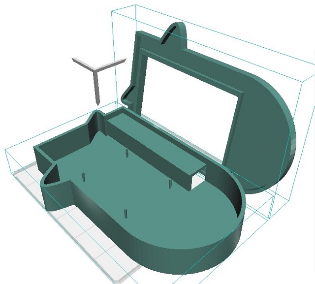
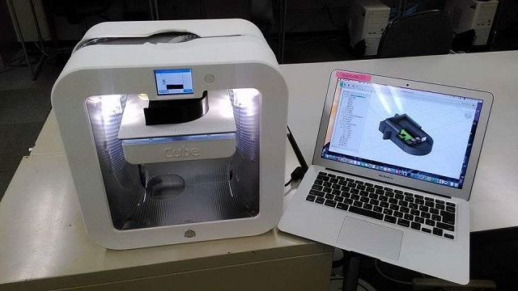
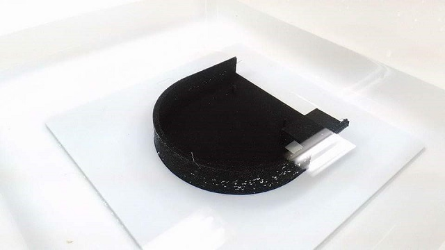
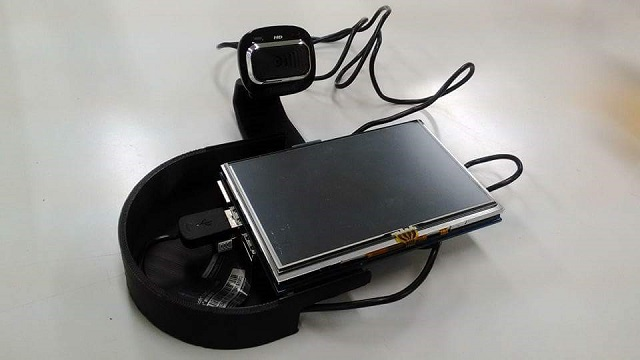
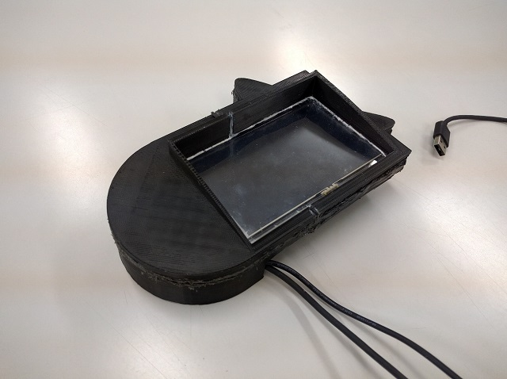
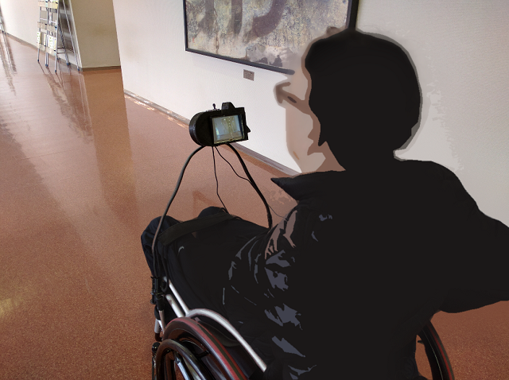
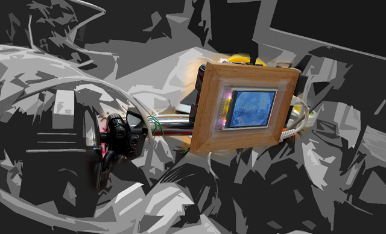
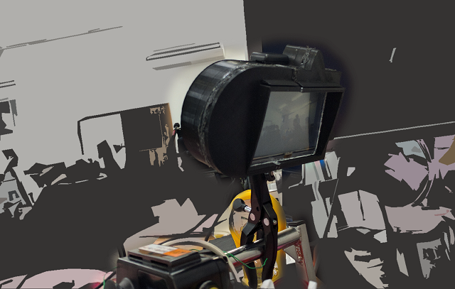

# 車椅子向けバックモニターの製作と実証

2016年6月28日

## 概要

* ニーズ
 * 「車椅子で通勤中に後ろを確認したい」

* とりあえず作ってみる
 * モバイルバッテリーで動作し、小型ディスプレイに背後を映すDIYバックモニター
 * 車椅子に合わせた筐体やアタッチメントを3Dプリンターで出力

## 構成

* Raspberry Pi 2 Model B
 * OpenCV (カメラ画像の取得、反転)
 * (当初はHTML5でカメラ画像を取得し、CSS Transformで反転させるというサクサク開発)

* Webカメラ
 * 30万画素〜100万画素
 * RPiの画像処理能力の関係もあり、最大640x480ぐらいの画像が取得できれば十分

## 製作

### 設計

3D CADソフトウェア「Fusion 360」にて設計

### 3Dデータを出力

1. 出力した3Dプリント品を水に入れ、耐水ペーパー等で加工
2. 出力した3Dデータと自作した電子機器を仮組み
3. 分割出力した3Dデータを組み合わせ、パテと防水フィルムで張り合わせ

## 使用

自走の際に手が干渉しないよう、着脱可能なフレームを取り付け

## ユーザー評価

* アイ・コラボレーションでのユーザー評価
 * NPO法人アイ・コラボレーション（草津市）にて、当事者によるユーザー評価

### ユーザー評価のコメント
* アングルの変更が容易なことが評価されました
* 特にストレッチャー利用者にとって、周囲の状況が分かるようになると好評でした